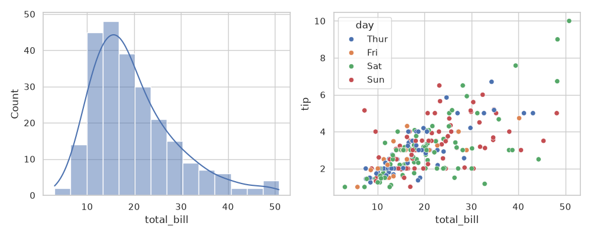
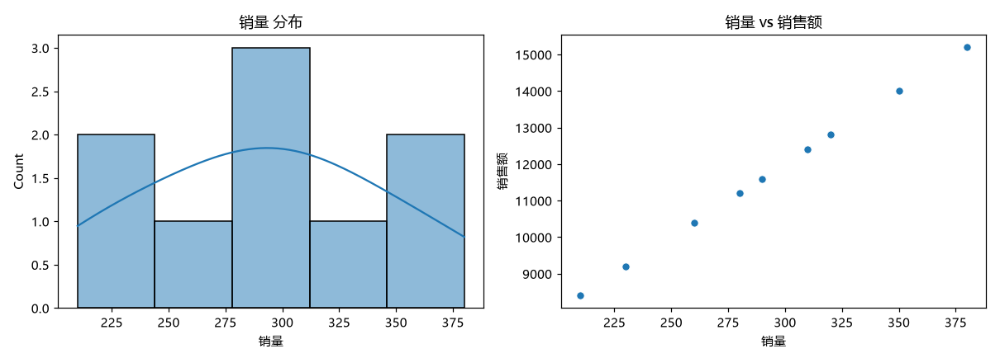

# 📖 项目复现说明书（图文版）

> 三个已复现项目：**seaborn** · **langchain** · **nanobot**
> 环境：WSL2 (Ubuntu-24.04) · Python 3.11 · 目录 `~/particle-anime/reproductions/`

---

## 1️⃣ seaborn —— 数据可视化（★★★★★ 实用）

### 是什么
Python 统计绘图库，一行代码出论文/报告级图表。

### 能干什么
```
柱状图/直方图/热力图/散点图/箱线图/回归图...
一键主题美化 (whitegrid/darkgrid)
与 pandas 无缝配合
```

### 怎么用
```bash
# 进入项目环境
cd ~/particle-anime
.venv/bin/python -c "
import seaborn as sns
import matplotlib.pyplot as plt
import pandas as pd

df = pd.read_csv('你的数据.csv')
sns.set_theme(style='whitegrid')
sns.histplot(df['列名'], kde=True)
plt.savefig('output.png', dpi=150)
print('✅ 图表已保存 output.png')
"
```

### 效果示例


### 常用技巧
| 需求 | 代码 |
|------|------|
| 分布图 | `sns.histplot(df['x'], kde=True)` |
| 热力图（相关性） | `sns.heatmap(df.corr(), annot=True)` |
| 分类散点 | `sns.scatterplot(data=df, x='a', y='b', hue='c')` |
| 箱线图 | `sns.boxplot(data=df, x='类别', y='数值')` |

---

## 2️⃣ langchain —— AI 应用组装工厂（★★★★★ 实用）

### 是什么
连接大模型与你的数据/工具的框架。demo 已做成"数据报表分析助手"。

### 能干什么
```
┌─────────────┐    ┌──────────────┐    ┌─────────────┐
│ CSV/Excel   │ →  │  langchain   │ →  │  DeepSeek   │
│ 你的数据     │    │ 统计+图表+AI  │    │ 智能解读    │
└─────────────┘    └──────────────┘    └─────────────┘
```

### 怎么用（立即可用——统计+图表）
```bash
cd ~/particle-anime/reproductions
../.venv/bin/python langchain_demo.py                    # 内置示例数据
../.venv/bin/python langchain_demo.py --csv 你的数据.csv  # 自己的数据
```
输出：统计摘要 + `analysis_chart.png` 图表



### 启用 AI 解读（需 API key，约 30 秒）
1. 去 **platform.deepseek.com** 注册，充值 ¥10 够用很久
2. 创建 API Key
3. 运行前设置：
```bash
export DEEPSEEK_API_KEY=sk-你的key
../.venv/bin/python langchain_demo.py --ask "销量最高的区域和原因?"
```

### 进阶玩法（写代码让 AI 干活）
```python
from langchain_openai import ChatOpenAI
from langchain_core.prompts import ChatPromptTemplate

llm = ChatOpenAI(model='deepseek-chat', api_key='sk-你的key',
                 base_url='https://api.deepseek.com/v1')
chain = ChatPromptTemplate.from_messages([
    ('system', '你是数据分析师'), ('human', '{q}')
]) | llm
print(chain.invoke({'q': '如何提升销售额?'}).content)
```

---

## 3️⃣ nanobot —— 个人 AI 小秘书（★★★★ 实用）

### 是什么
轻量本地 AI 助手框架（4.6 万 star），带网页聊天界面，数据全在本地。

### 能干什么
```
┌─ 浏览器 ─┐      ┌─ nanobot 本地服务 ─┐
│ 聊天界面 │ ←──→ │  多模型支持        │
│ 传文件   │      │  工具调用/记忆     │
│ 多会话   │      │  完全本地/私密     │
└──────────┘      └────────────────────┘
```

### 怎么用
```bash
# 1. 启动 (已配置 DeepSeek provider)
cd ~/particle-anime
.venv/bin/nanobot webui

# 2. 浏览器自动打开 http://localhost:8765
# 3. 设置 → Models → 填 DeepSeek API Key → 开聊
```

### 首次配置（一次性）
```bash
# 编辑配置文件填入 key
nano ~/.nanobot/config.json
# providers.deepseek.apiKey = "sk-你的key"
```

### 常用命令
| 命令 | 作用 |
|------|------|
| `nanobot webui` | 启动网页界面 |
| `nanobot agent "问题"` | 命令行直接问 |
| `nanobot serve` | 启动 OpenAI 兼容 API |
| `nanobot status` | 查看状态 |

---

## 📋 三项目对比

| 项目 | 实用度 | 难度 | 立即能用? | 需要 API key? |
|------|--------|------|----------|--------------|
| seaborn | ★★★★★ | 低 | ✅ | ❌ |
| langchain | ★★★★★ | 中 | ✅ 统计部分 | AI 解读需要 |
| nanobot | ★★★★ | 中 | ✅ 界面 | ✅ 聊天需要 |

## 💡 推荐学习顺序
1. **seaborn**（半天）→ 立刻提升图表质量
2. **langchain**（1-2天）→ 数据+AI 自动化
3. **nanobot**（半天）→ 私人 AI 助手常驻

## ❓ 常见问题
**Q: DeepSeek API key 怎么获取？**
A: platform.deepseek.com 注册 → API Keys → 创建（新用户送额度，充值 ¥10 能用几个月）

**Q: 中文字体乱码？**
A: 已配置微软雅黑（WSL 引用 Windows 字体），正常无需处理

**Q: 想停掉 nanobot？**
A: 终端 Ctrl+C 或 `pkill -f nanobot`

---

*说明书由 Hermes Agent 生成 · 2026-08-02*
